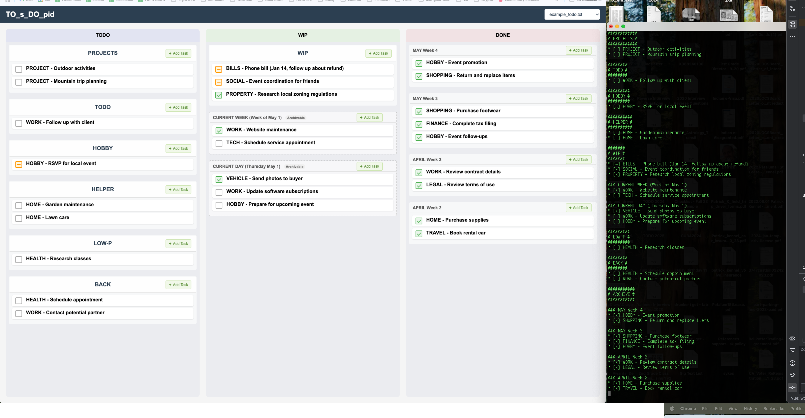

# STUPID TO DO LIST

This is a really really stupid to do list web app that shouldn't exist.


[Watch it, stupid](https://www.youtube.com/watch?v=mzJVpDaHGUg)

## Features
- Only the maintainer knows how to use it - watch the video. Like, thumbs up and subscribe.
- It's so stupid that the database is a text file.
- It only runs on your computer machine and you have to be a developer to know how to run it

## Prerequisites

- Node.js (v14 or newer recommended)
- npm (comes with Node.js)

## Project Setup

1. Clone or download this repository to your local machine
2. Navigate to the project directory in your terminal
3. Run `npm install` to install dependencies
4. Run `npm run dev` to start the development server
5. Open your browser and navigate to `http://localhost:5173`

## Custom Todo Files and Directories

You can configure multiple directories and individual todo files using a stupidly named YAML configuration file:

1. Copy `stupid.yaml.example` to `stupid.yaml`
2. Edit `stupid.yaml` and add:
   - Directories to scan for `.todo.md` files
   - Individual `.todo.md` file paths
3. Restart the server

Example configuration:
```yaml
# Directories to scan for .todo.md files
directories:
  - /Users/username/Documents/todos
  - /Users/username/Projects/todos

# Individual todo files to include
files:
  - /Users/username/Desktop/personal.todo.md
  - /Users/username/work/project.todo.md
```

Custom files will be displayed with a "Custom" or "Dir" badge in the file tabs.
