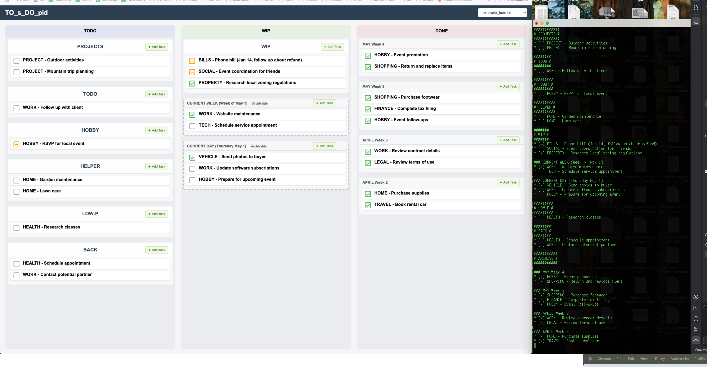

# STUPID TO DO LIST

This is a really really stupid to do list web app that shouldn't exist.


[Watch it, stupid](https://www.youtube.com/watch?v=mzJVpDaHGUg)

## Features
- Only the maintainer knows how to use it — watch the video. Like, thumbs up and subscribe.
- It's so stupid that the database is a plain markdown file.
- It only runs on your computer machine and you have to be a developer to know how to run it.
- Five-column Kanban layout: **TODO → PROJECTS → SELECTED → WIP → DONE**
- Multiple files as tabs — switch between todos from different directories or individual files
- H1 (`#`) column headers, H2 (`##`) and H3 (`###`) section headers within columns
- Task states: open `[ ]`, in progress `[~]`, done `[x]`, cancelled `[-]`
- Due dates: `!!(YYYY-MM-DD)`; completion dates auto-stamped when you flip a task to done
- Drag + drop tasks and sections across sections, columns, and stacks
- Multi-select (cmd/ctrl + click) with multi-drag (stacked visual preview) and bulk "Move to" via right-click
- Right-click context menu with a column → section submenu for precise moves
- View modes: **Triage** (expand TODO/PROJECTS/SELECTED, collapse WIP/ARCHIVE) and **Focus** (expand SELECTED/WIP, collapse the rest)
- Tri-state column caret to collapse all sections, expand all, or partial-collapse
- Notes inline with tasks, including multi-line notes
- Raw-text passthrough: anything the parser doesn't understand is preserved verbatim and toggleable with a "Show raw text" switch
- Archive confirmation modal when dragging a section into DONE/ARCHIVE
- **Version history panel** per tab: daily backups written to `.TO_s_DO_pid.bak/<name>/`, viewable as a unified diff vs. the current file, with full-version restore and per-line restore-on-hover
- Live file sync over WebSocket: if the file changes on disk (external editor, git pull, restore), the UI reloads automatically

## Prerequisites

- Node.js (v14 or newer recommended)
- npm (comes with Node.js)

## Project Setup

1. Clone or download this repository to your local machine
2. Navigate to the project directory in your terminal
3. Run `npm install` to install dependencies
4. Run `npm run dev` to start the frontend (Vite on port **8081**) and backend (Express on port 3001) concurrently
5. Open your browser and navigate to `http://localhost:8081`

## Custom Todo Files and Directories

You can configure multiple directories and individual todo files using a stupidly named YAML configuration file:

1. Copy `stupid.yaml.example` to `stupid.yaml`
2. Edit `stupid.yaml` and add:
   - Directories to scan for `.todo.md` files
   - Individual `.todo.md` file paths
3. Restart the server

Example configuration:
```yaml
# Directories to scan for .todo.md files
directories:
  - /Users/username/Documents/todos
  - /Users/username/Projects/todos

# Individual todo files to include
files:
  - /Users/username/Desktop/personal.todo.md
  - /Users/username/work/project.todo.md
```

Custom files appear as tabs with a green accent; built-in (repo-local) files get a grey accent.

## Column Organization

The app automatically organizes your H1 (`#`) section headers into five columns based on keywords in the header name:

| Column Stack | Keywords that match |
| --- | --- |
| **TODO**     | TODO, BACKLOG, INBOX, LATER, SOMEDAY, IDEAS, ICE |
| **PROJECTS** | PROJECTS, PROJECT |
| **SELECTED** | SELECTED, HOLD, ONGOING |
| **WIP**      | WIP, SCHEDULED, IN PROGRESS, IN-PROGRESS, DOING, CURRENT, ACTIVE |
| **DONE**     | DONE, COMPLETE, COMPLETED, ARCHIVE, FINISHED, RESOLVED |

Mappings live in `src/utils/TodoMdParser.js` under `COLUMNSTACK_CATEGORIES`.

Example:
```markdown
# TODO
* [ ] Task 1

# PROJECTS
### Project Alpha
* [ ] First step

# SELECTED
### Week 1
* [ ] Prioritized task

# WIP
### Sprint 2
* [~] Task in progress

# ARCHIVE
* [x] Completed task
```

## Backups and Version History

Every save automatically snapshots the file (once per day, first write) into:

```
<file-dir>/.TO_s_DO_pid.bak/<filename-without-ext>/<filename>.bak.YYYY-MM-DD.<ext>
```

Click the ↺ icon on the tab bar to open the **Version history** panel. It lists every daily backup with date + time, shows a collapsed unified diff of the selected version against what's currently on disk, and offers two restore modes:

- **Restore this version** — replace the current file wholesale with the selected snapshot.
- **Hover-restore a single line** — hover any red (removed) line in the diff and click the small "Restore" pill to splice that single line back into the current file, at its original neighbourhood.

All restore writes go through the normal save path, so they themselves become part of the backup history.
